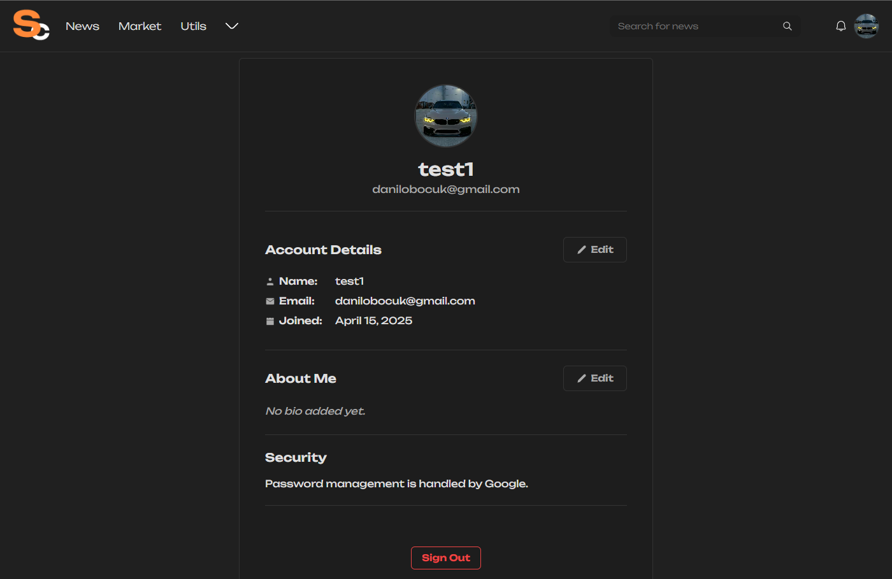

# 📰 Financial News

> A full-stack application that delivers real-time financial news updates, designed for educational purposes.

---

## 📸 Preview




---

## 🚀 Features

- 🗞️ Real-time fetching of financial news from multiple APIs.
- 🔒 Authorization and login system, Google Auth 3.0 also.
- 💾 Backend API built with NestJS and connected to a MySQL database.
- 🖼️ Responsive Angular frontend.

---

## 🧰 Technologies Used

| Frontend       | Backend    | Database | Tools / Other                     |
|----------------|------------|----------|----------------------------------|
| Angular, RxJS  | NestJS     | MySQL    | VSCode, Git, Postman, Docker     |

---

## 🧑‍💻 Getting Started

1. **Clone the project**
```bash
git clone https://github.com/d3cryptex/finance_market.git
```

2. **Install dependencies**
```bash
cd frontend
npm install

cd ../backend
npm install
```

3. **Database Setup**

Since ``synchronize: true`` is enabled in the TypeORM configuration, the tables will be automatically created based on the entities defined in the code. You don't need to manually create the database structure — TypeORM will handle it for you.
However, if you prefer to manually create the database or need to reset the schema, below is the structure of the required tables.


🧍 User Table
```sql
CREATE TABLE User (
  id VARCHAR(255) PRIMARY KEY,
  name VARCHAR(100) NOT NULL,
  email VARCHAR(255) NOT NULL UNIQUE,
  password VARCHAR(255),
  isGoogleAccount BOOLEAN DEFAULT FALSE,
  googleId VARCHAR(255),
  avatar_url VARCHAR(255) NOT NULL DEFAULT '/assets/img/avatar.png',
  bio TEXT,
  createdAt TIMESTAMP(6) DEFAULT CURRENT_TIMESTAMP(6)
);
```

📰 News Table
```sql
CREATE TABLE News (
  id INT AUTO_INCREMENT PRIMARY KEY,
  newsid VARCHAR(255) NOT NULL,
  title VARCHAR(255) NOT NULL,
  description TEXT,
  content TEXT,
  url VARCHAR(255) NOT NULL,
  urlToImage VARCHAR(255),
  source JSON NOT NULL,
  date DATE NOT NULL
);
```
> 💡 Note: With synchronize: true set in the TypeORM configuration, these tables will be automatically created when you first run the backend. You do not need to create them manually.

4. **Set up environment variables**
```env
POLYGON_API_KEY=you need to put your polygon api key
NEWS_API_KEY=you need to put your news api key
ALPHAVANTAGE_API_KEY=you need to put your alphavantage api key
BACKEND_URL=localhost
DB_HOST=localhost
DB_PORT=here your port
DB_USERNAME=here your username (example: root)
DB_PASSWORD=here your password
DB_NAME=here name your db
```

5. **Run the project**
```bash
# Frontend
cd frontend
ng serve

# Backend
cd ../backend
npm run start:dev
```

---

## 📦 Deployment

Frontend can be deployed using Vercel or Netlify.  
Backend can be deployed on Render, Railway, or VPS.  
Ensure the database is available remotely.

---

## 📬 Contact

[](https://discord.com/users/6275)
[](https://t.me/d3cryptex)
[](mailto:danilobocuk@gmail.com)

---

**Made with ❤️ to help you _learn by building_.**

By **d3cryptex**
